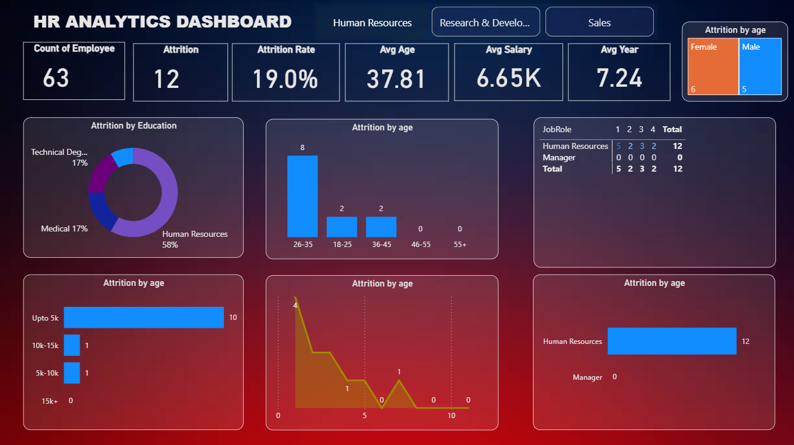
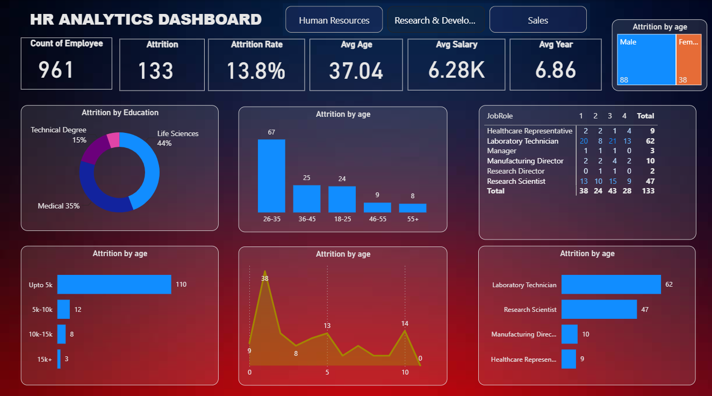
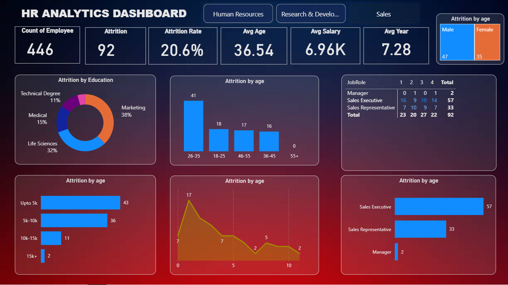

# HR Employee Retention & Attrition Analytics

## 📌 Project Overview
The objective of this project is to analyze employee attrition drivers and provide actionable insights for the Human Resources department. By examining demographic, financial, and organizational data, this dashboard helps identify high-risk attrition groups and evaluate the impact of various factors on employee retention. 

**Author**: Prashant Sharma  
**Tools Used**: Power BI, SQL, Data Modeling, Excel  
**Dataset Origin**: The IBM HR Analytics Employee Attrition & Performance dataset (Kaggle).

## 📊 Dashboard Previews
The dashboard is designed with three dedicated phases to provide targeted, department-specific insights:

### 1. Human Resources View
*Focuses on overall workforce metrics, company-wide attrition, and demographic breakdowns.*

### 2. Research & Development (R&D) View
*Drills down into the R&D department, highlighting attrition across technical roles like Laboratory Technicians and Research Scientists.*

### 3. Sales View
*Analyzes turnover within the Sales team, specifically tracking Sales Executives and Representatives against compensation and tenure.*

## 💡 Key Business Insights
Based on the dashboard visualizations and SQL queries, the following insights were derived:
1. **Overall Attrition:** The company is experiencing a **16.1% attrition rate**, with a total of 237 employees leaving out of a ~1.47K workforce.
2. **Salary & Retention:** There is a strong negative correlation between salary and attrition. The highest attrition is concentrated in the **"Upto 5k" salary slab** (163 employees), suggesting that entry-level or lower-band compensation is a critical driver for turnover.
3. **Age & Experience Factor:** Employees in the **26-35 age group** are the most likely to leave (116 employees). Additionally, the attrition rate spikes heavily around the **1-year mark** of employment, indicating early-tenure dissatisfaction.
4. **Job Role Vulnerability:** **Laboratory Technicians (62) and Sales Executives (57)** have the highest absolute turnover rates across all departments.
5. **Educational Background:** Employees with a **Life Sciences (38%) or Medical (27%)** background account for the majority of the attrition.

## 🛠️ Technical Implementation
- **Data Cleaning & Transformation:** Handled duplicate records and standardized formatting using Power Query. Created custom columns for `AgeGroup` and `SalarySlab` using DAX expressions to facilitate grouping.
- **Data Modeling:** Established a star schema model to connect dimensional tables (like Department and Job Role) to the central fact table.
- **SQL Analysis:** Executed data validation and exploratory data analysis using SQL. The query scripts replicating the dashboard logic are available in the `SQL_Queries/` directory.

## 📁 Repository Contents
- `/Data`: Contains the raw dataset used for analysis.
- `/Dashboard`: Contains the Power BI (.pbix) file and all department-level visual assets.
- `/SQL_Queries`: Contains `.sql` files with the data extraction and aggregation logic.
